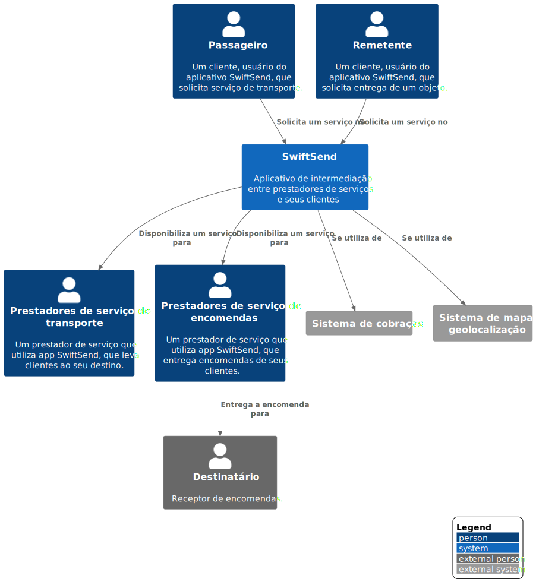

# SwiftSend

* [SwiftSend](#SwiftSend)
  * [SwiftSend](#SwiftSend)
    * [API Application](#API-Application)
    * [Database](#Database)
    * [Mobile App Cliente](#Mobile-App-Cliente)
    * [Mobile App Prestador](#Mobile-App-Prestador)
    * [Single Page Application](#Single-Page-Application)
    * [Web Application](#Web-Application)

---

## SwiftSend

**Nível 1: diagrama de contexto do sistema**

**Escopo**: O SwiftSend tem como objetivo agenciar serviços alternativos de transporte, como serviços de entrega ou transporte de pessoas.

**Elementos primários**: 
* Cliente (Passageiro/Remetente)
* Prestadores de serviço (encomendas/transporte)
* SwiftSend
 

**Elementos de suporte**: 
* Sistema Cobraças
* Sistema geolocalização
* Destinatário
 

**Público-alvo**: Clientes e Prestadores de serviço

## SwiftSend

**Nível 2: Diagrama de contêiner**

**Escopo**: Sistema de software da SwiftSend.

**Elementos primários**: 
* Web Application
* Single Page Application
* Mobile App Cliente
* Mobile App Prestador
* Database
* API Application
 

**Elementos de suporte**:
* Passageiro
* Remetente
* Prestadores de serviço de transporte
* Prestadores de serviço de encomendas
* Sistema de cobraças
* Sistema de mapa e geolocalização
 

**Público-alvo**: Técnicos dentro e fora da equipe de desenvolvimento de software; incluindo arquitetos de software, desenvolvedores e equipe de operações/suporte.

## API Application

`\SwiftSend\API Application`

[SwiftSend](#SwiftSend)

**Level 3: Diagrama componente**

**Escopo**: Contêiner de API Application.

**Elementos primários**:
* Tokens Controller
* Perfil Controller
* Serviços SwiftSend Controller
* Camada de segurança
* Sistema de pagamento Facade
 

**Elementos de suporte**:
* Single Page Application
* Mobile App Cliente
* Mobile App Prestador
* Database
* Sistema de cobraças
 

**Público-alvo**: arquitetos e desenvolvedores de software.

## Database

`\SwiftSend\Database`

[SwiftSend](#SwiftSend)

**Level 3: Diagrama componente**

**Escopo**: Contêiner da Database.

**Elementos primários**:
* Profile_tokens_dao
* Profile_client_dao
* Profile_provider_dao
* Profile_payment_dao
* Profile_history_dao
* Profile_banks_accounts_dao
* Profile_wallet_dao
* Services_dao
* Services_geolocation_dao
* Services_payment_dao
* Services_ranking_dao
 

**Elementos de suporte**:
* API Application
 

**Público-alvo**: arquitetos e desenvolvedores de software.

## Mobile App Cliente

`\SwiftSend\Mobile App Cliente`

[SwiftSend](#SwiftSend)

**Level 3: Diagrama componente**

**Escopo**: Contêiner de API Application.

**Elementos primários**:
* Tokens Controller
* Perfil Controller
* Serviços SwiftSend Controller
* Camada de segurança
* Sistema de pagamento Facade
 

**Elementos de suporte**:
* Single Page Application
* Mobile App Cliente
* Mobile App Prestador
* Database
* Sistema de cobraças
 

**Público-alvo**: arquitetos e desenvolvedores de software.

## Mobile App Prestador

`\SwiftSend\Mobile App Prestador`

[SwiftSend](#SwiftSend)

**Level 3: Diagrama componente**

**Escopo**: Contêiner de API Application.

**Elementos primários**:
* Tokens Controller
* Perfil Controller
* Serviços SwiftSend Controller
* Camada de segurança
* Sistema de pagamento Facade
 

**Elementos de suporte**:
* Single Page Application
* Mobile App Cliente
* Mobile App Prestador
* Database
* Sistema de cobraças
 

**Público-alvo**: arquitetos e desenvolvedores de software.

## Single Page Application

`\SwiftSend\Single Page Application`

[SwiftSend](#SwiftSend)

**Level 3: Diagrama componente**

**Escopo**: Contêiner de API Application.

**Elementos primários**:
* Tokens Controller
* Perfil Controller
* Serviços SwiftSend Controller
* Camada de segurança
* Sistema de pagamento Facade
 

**Elementos de suporte**:
* Single Page Application
* Mobile App Cliente
* Mobile App Prestador
* Database
* Sistema de cobraças
 

**Público-alvo**: arquitetos e desenvolvedores de software.

## Web Application

`\SwiftSend\Web Application`

[SwiftSend](#SwiftSend)

**Level 3: Diagrama componente**

**Escopo**: Contêiner de API Application.

**Elementos primários**:
* Controller
* View
 

**Elementos de suporte**:
* Passageiro
* Remetente
* Single Page Application
 

**Público-alvo**: arquitetos e desenvolvedores de software.