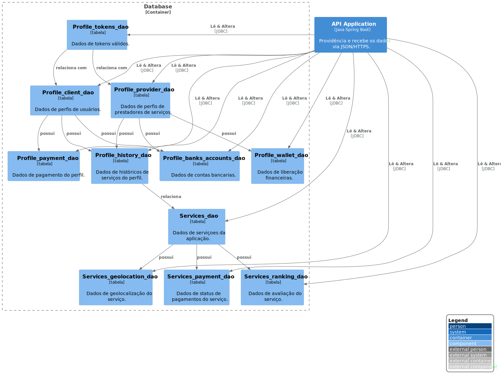

# Database

`\SwiftSend\Database`

* [SwiftSend](../../README.md)
  * [SwiftSend](../../SwiftSend/README.md)
    * [API Application](../../SwiftSend/API%20Application/README.md)
    * [**Database**](../../SwiftSend/Database/README.md)
    * [Mobile App Cliente](../../SwiftSend/Mobile%20App%20Cliente/README.md)
    * [Mobile App Prestador](../../SwiftSend/Mobile%20App%20Prestador/README.md)
    * [Single Page Application](../../SwiftSend/Single%20Page%20Application/README.md)
    * [Web Application](../../SwiftSend/Web%20Application/README.md)

---

[SwiftSend (up)](../../SwiftSend/README.md)

---

**Level 3: Diagrama componente**

**Escopo**: Contêiner da Database.

**Elementos primários**:
* Profile_tokens_dao
* Profile_client_dao
* Profile_provider_dao
* Profile_payment_dao
* Profile_history_dao
* Profile_banks_accounts_dao
* Profile_wallet_dao
* Services_dao
* Services_geolocation_dao
* Services_payment_dao
* Services_ranking_dao
 

**Elementos de suporte**:
* API Application
 

**Público-alvo**: arquitetos e desenvolvedores de software.