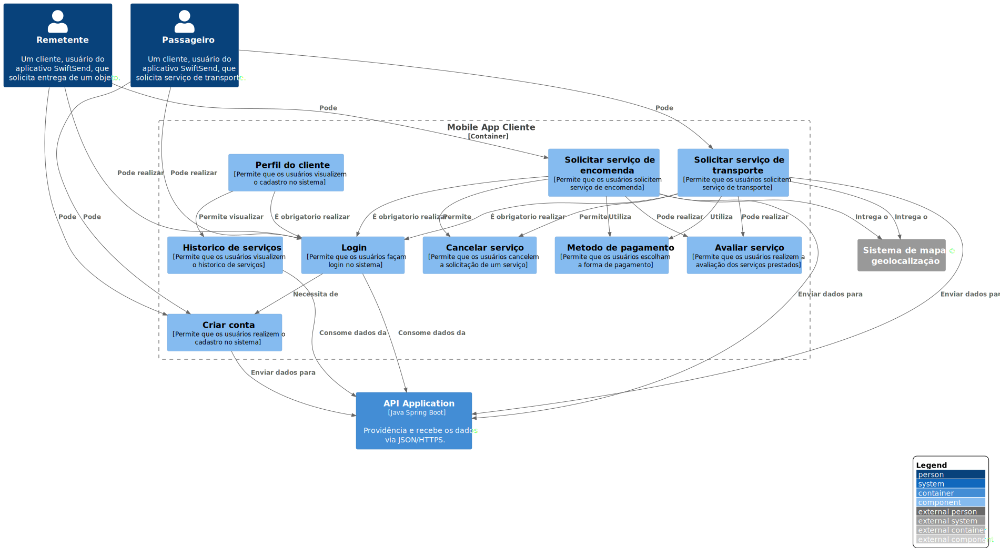

# Mobile App Cliente

`\SwiftSend\Mobile App Cliente`

* [SwiftSend](../../README.md)
  * [SwiftSend](../../SwiftSend/README.md)
    * [API Application](../../SwiftSend/API%20Application/README.md)
    * [Database](../../SwiftSend/Database/README.md)
    * [**Mobile App Cliente**](../../SwiftSend/Mobile%20App%20Cliente/README.md)
    * [Mobile App Prestador](../../SwiftSend/Mobile%20App%20Prestador/README.md)
    * [Single Page Application](../../SwiftSend/Single%20Page%20Application/README.md)
    * [Web Application](../../SwiftSend/Web%20Application/README.md)

---

[SwiftSend (up)](../../SwiftSend/README.md)

---

**Level 3: Component diagram**

Next you can zoom in and decompose each container further to identify the major structural building blocks and their interactions.

The Component diagram shows how a container is made up of a number of "components", what each of those components are, their responsibilities and the technology/implementation details.

**Scope**: A single container.

**Primary elements**: Components within the container in scope.
Supporting elements: Containers (within the software system in scope) plus people and software systems directly connected to the components.

**Intended audience**: Software architects and developers.