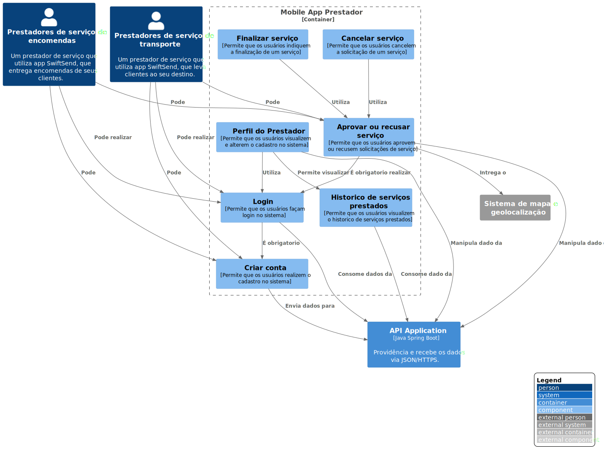

# Mobile App Prestador

**Level 3: Diagrama componente**

**Escopo**: Contêiner de Mobile App Prestador.

**Elementos primários**:
* Criar conta
* Login
* Aprovar ou recusar serviço
* Historico de serviços prestados
* Cancelar serviço
* Finalizar serviço
* Perfil do Prestador
 

**Elementos de suporte**:
* Prestadores de serviço de transporte
* Prestadores de serviço de encomendas
* Sistema de mapa e geolocalização
* API Application
 

**Público-alvo**: arquitetos e desenvolvedores de software.