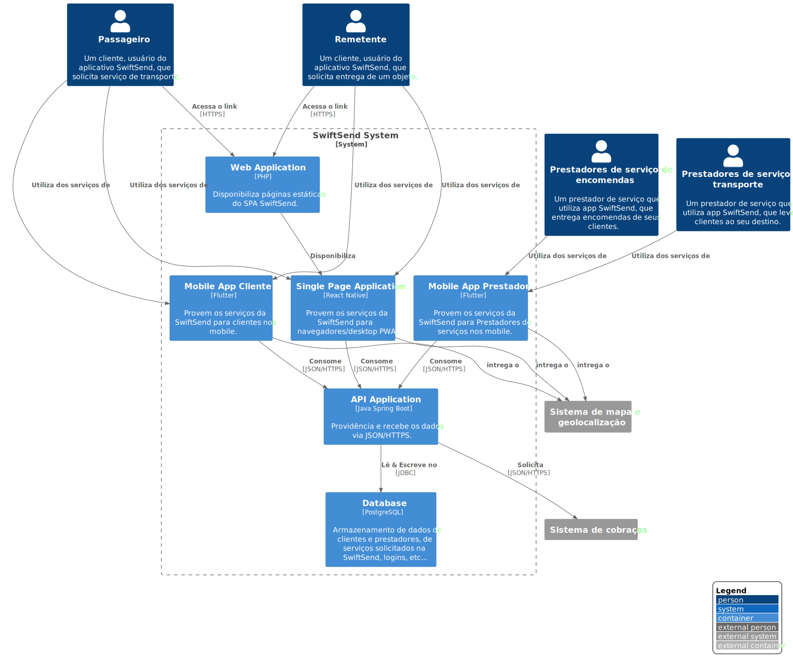

# SwiftSend

* [SwiftSend](../README.md)
  * [**SwiftSend**](../SwiftSend/README.md)
    * [API Application](../SwiftSend/API%20Application/README.md)
    * [Database](../SwiftSend/Database/README.md)
    * [Mobile App Cliente](../SwiftSend/Mobile%20App%20Cliente/README.md)
    * [Mobile App Prestador](../SwiftSend/Mobile%20App%20Prestador/README.md)
    * [Single Page Application](../SwiftSend/Single%20Page%20Application/README.md)
    * [Web Application](../SwiftSend/Web%20Application/README.md)

---

[SwiftSend (up)](../README.md)

- [API Application](../SwiftSend/API%20Application/README.md)

- [Database](../SwiftSend/Database/README.md)

- [Mobile App Cliente](../SwiftSend/Mobile%20App%20Cliente/README.md)

- [Mobile App Prestador](../SwiftSend/Mobile%20App%20Prestador/README.md)

- [Single Page Application](../SwiftSend/Single%20Page%20Application/README.md)

- [Web Application](../SwiftSend/Web%20Application/README.md)

---

**Nível 2: Diagrama de contêiner**

**Escopo**: Sistema de software da SwiftSend.

**Elementos primários**: 
* Web Application
* Single Page Application
* Mobile App Cliente
* Mobile App Prestador
* Database
* API Application
 

**Elementos de suporte**:
* Passageiro
* Remetente
* Prestadores de serviço de transporte
* Prestadores de serviço de encomendas
* Sistema de cobraças
* Sistema de mapa e geolocalização
 

**Público-alvo**: Técnicos dentro e fora da equipe de desenvolvimento de software; incluindo arquitetos de software, desenvolvedores e equipe de operações/suporte.