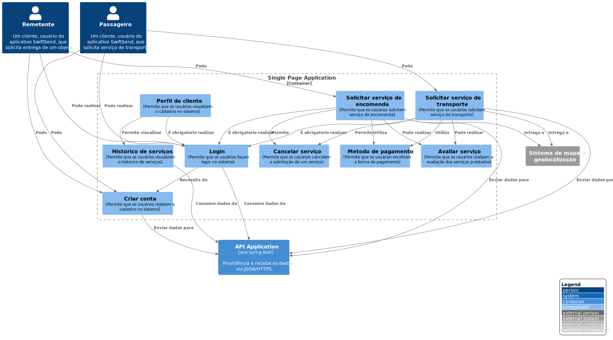

# Single Page Application

**Level 3: Diagrama componente**

**Escopo**: Contêiner de Single Page Application.

**Elementos primários**:
* Criar conta
* Login
* Perfil do cliente
* Solicitar serviço de encomenda
* Metodo de pagamento
* Avaliar serviço
* Historico de serviços
* Cancelar serviço
* Solicitar serviço de transporte
 

**Elementos de suporte**:
* Passageiro
* Remetente
* Sistema de mapa e geolocalização
* API Application
 

**Público-alvo**: arquitetos e desenvolvedores de software.