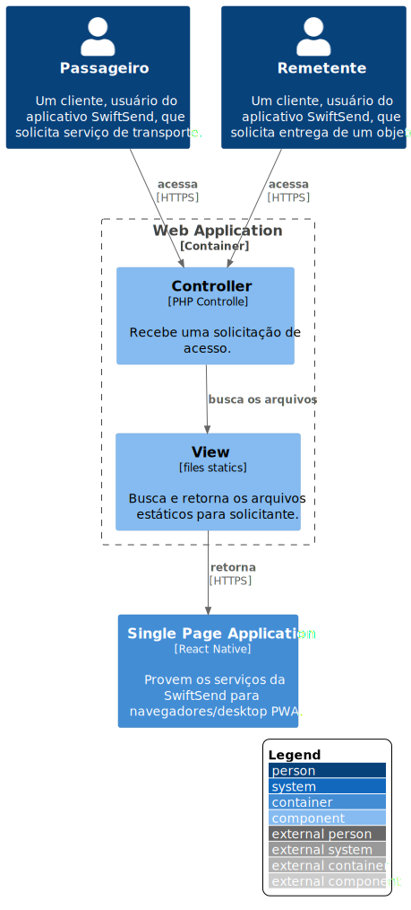

# Web Application

**Level 3: Diagrama componente**

**Escopo**: Contêiner de Web Application.

**Elementos primários**:
* Controller
* View
 

**Elementos de suporte**:
* Passageiro
* Remetente
* Single Page Application
 

**Público-alvo**: arquitetos e desenvolvedores de software.