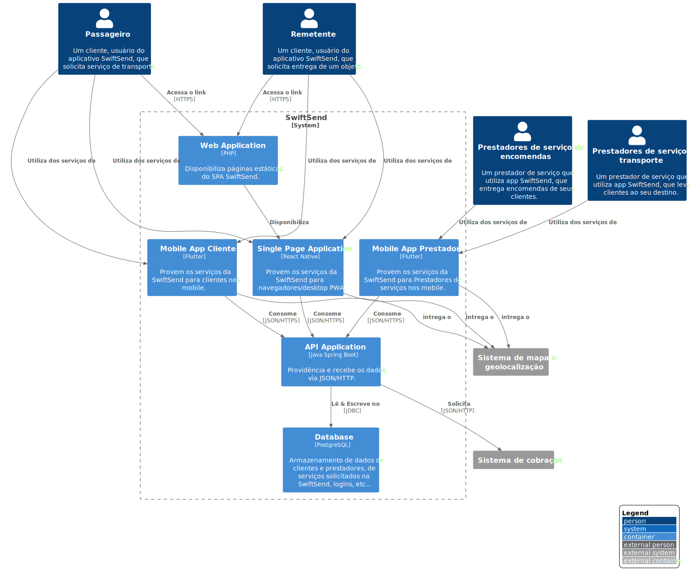

# SwitfSend

**Nível 2: Diagrama de contêiner**

**Escopo**: Sistema de software da SwiftSend.

**Elementos primários**: 
* Web Application
* Single Page Application
* Mobile App Cliente
* Mobile App Prestador
* Database
* API Application
 

**Elementos de suporte**:
* Passageiro
* Remetente
* Prestadores de serviço de transporte
* Prestadores de serviço de encomendas
* Sistema de cobraças
* Sistema de mapa e geolocalização
 

**Público-alvo**: Técnicos dentro e fora da equipe de desenvolvimento de software; incluindo arquitetos de software, desenvolvedores e equipe de operações/suporte.