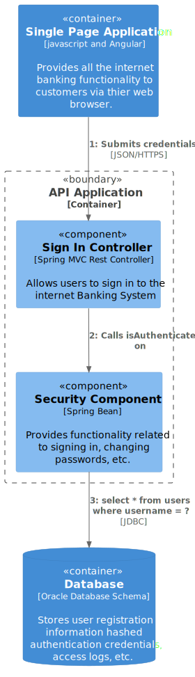

# Dynamic Diagram

`\SwitfSend\Single Page Application\Dynamic Diagram`

* [SwiftSend](../../../README.md)
  * [SwitfSend](../../../SwitfSend/README.md)
    * [API Application](../../../SwitfSend/API%20Application/README.md)
    * [Single Page Application](../../../SwitfSend/Single%20Page%20Application/README.md)
      * [**Dynamic Diagram**](../../../SwitfSend/Single%20Page%20Application/Dynamic%20Diagram/README.md)
      * [Extended Docs](../../../SwitfSend/Single%20Page%20Application/Extended%20Docs/README.md)

---

[Single Page Application (up)](../../../SwitfSend/Single%20Page%20Application/README.md)

---

**Dynamic diagram**

A simple dynamic diagram can be useful when you want to show how elements in a static model collaborate at runtime to implement a user story, use case, feature, etc. This dynamic diagram is based upon a UML communication diagram (previously known as a "UML collaboration diagram"). It is similar to a UML sequence diagram although it allows a free-form arrangement of diagram elements with numbered interactions to indicate ordering.

**Scope**: An enterprise, software system or container.

**Primary and supporting elements**: Depends on the diagram scope; enterprise (see System Landscape diagram), software system (see System Context or Container diagrams), container (see Component diagram).

**Intended audience**: Technical and non-technical people, inside and outside of the software development team.