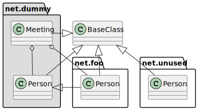
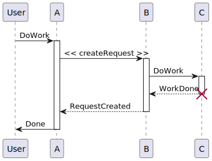

# Extended Docs

Multiple markdowns can be ordered using `<name>.1.md, <name>.2.md .. <name>.<n>.md`

You can choose where to place a certain diagram by using ``

Feel free to add any additional details necesary.
