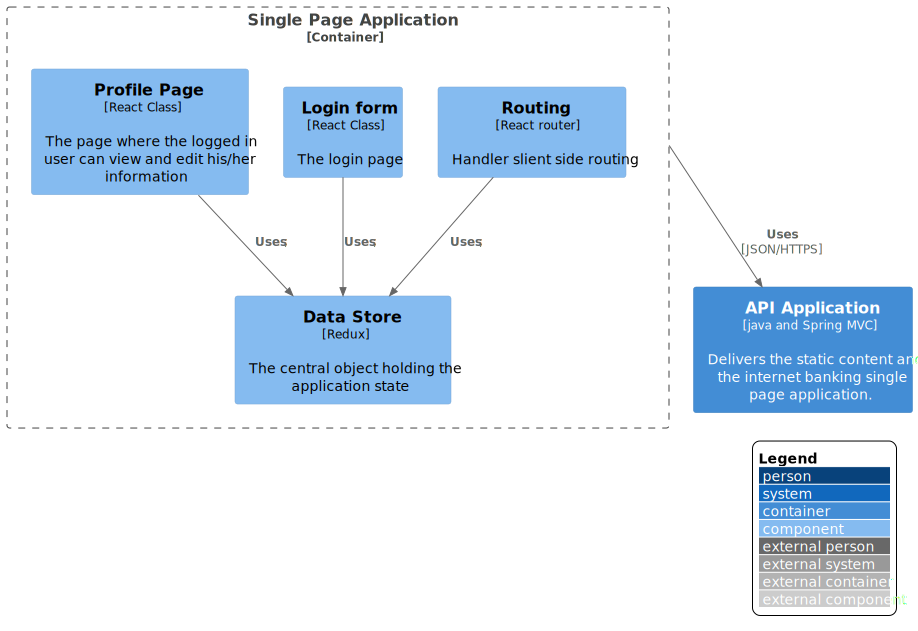

# Single Page Application

`\SwitfSend\Single Page Application`

* [SwiftSend](../../README.md)
  * [SwitfSend](../../SwitfSend/README.md)
    * [API Application](../../SwitfSend/API%20Application/README.md)
    * [**Single Page Application**](../../SwitfSend/Single%20Page%20Application/README.md)
      * [Dynamic Diagram](../../SwitfSend/Single%20Page%20Application/Dynamic%20Diagram/README.md)
      * [Extended Docs](../../SwitfSend/Single%20Page%20Application/Extended%20Docs/README.md)

---

[SwitfSend (up)](../../SwitfSend/README.md)

- [Dynamic Diagram](../../SwitfSend/Single%20Page%20Application/Dynamic%20Diagram/README.md)

- [Extended Docs](../../SwitfSend/Single%20Page%20Application/Extended%20Docs/README.md)

---

**Level 3: Component diagram**

Next you can zoom in and decompose each container further to identify the major structural building blocks and their interactions.

The Component diagram shows how a container is made up of a number of "components", what each of those components are, their responsibilities and the technology/implementation details.

**Scope**: A single container.

**Primary elements**: Components within the container in scope.
Supporting elements: Containers (within the software system in scope) plus people and software systems directly connected to the components.

**Intended audience**: Software architects and developers.

> Example of included local image

